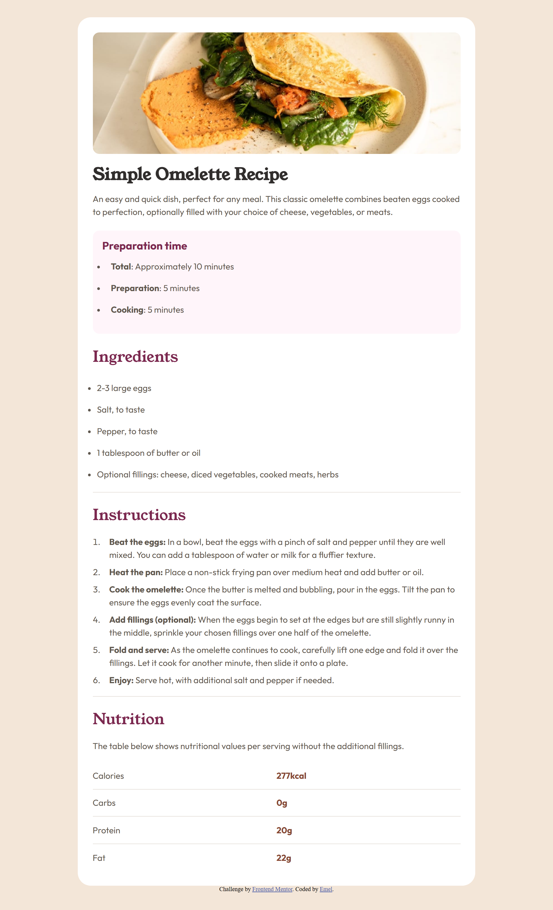

# Frontend Mentor - Recipe page


## Welcome! 👋

## Table of contents

- [Overview](#overview)
  - [The challenge](#the-challenge)
  - [Screenshot](#screenshot)
  - [Links](#links)
- [My process](#my-process)
  - [Built with](#built-with)
  - [What I learned](#what-i-learned)
  - [Continued development](#continued-development)
  - [Useful resources](#useful-resources)
- [Author](#author)


**Note: Delete this note and update the table of contents based on what sections you keep.**

## Overview
Users should be able to:
- View the optimal layout depending on their device’s screen size
- See hover and focus states for interactive elements (if any)
- Read semantic, accessible HTML (lists, ordered steps, table with caption/scope, time elements)
### Screenshot




### Links

- Solution URL: [Add solution URL here](https://github.com/Emelinur/recipe-page-main)
- Live Site URL: [Add live site URL here](https://emelinur.github.io/recipe-page-main/)

## My process

### Built with

- **Semantic HTML5** (single `h1`, sectioned `h2`, `<time>`, `<data>`, table with `caption` + `scope`)
- **CSS Custom Properties** (colors, spacing, type tokens)
- **Fluid sizing with `clamp()`** (375 → 1440 without media queries for type/spacing)
- **CSS Grid** (simple page-level alignment with `place-items`)
- **Flexbox** (component-level layout and gaps)
- **Dynamic viewport units (`dvh`)** (handles mobile URL bar height changes)
- **Mobile-first mindset**

### What I learned

#### 1-) Simple page alignment with Grid (no absolute math)
```css
body {
  min-height: 100dvh;              /* dynamic viewport height */
  display: grid;
  place-items: start center;       /* vertical: start, horizontal: center */
  padding: clamp(24px, 4vw, 48px); /* fluid page padding */
  background: var(--stone-100);
}
```
#### 2-) Fluid typography/spacing without media queries (clamp + lerp)
```css
:root {
  --vw-min: 375px;
  --vw-max: 1440px;
  --fluid: calc((100vw - var(--vw-min)) / (var(--vw-max) - var(--vw-min)));
}

/* H1 scales exactly from fs-2 at 375px to fs-1 at 1440px */
.text-content h1 {
  font-size: clamp(
    var(--fs-2),
    calc(var(--fs-2) + (var(--fs-1) - var(--fs-2)) * var(--fluid)),
    var(--fs-1)
  );
}

/* Example spacing token scaling 8px → 128px across the same range */
:root {
  --space-1600: clamp(
    8px,
    calc(8px + (128px - 8px) * ((100vw - var(--vw-min)) / (var(--vw-max) - var(--vw-min)))),
    128px
  );
}
```
#### 3-) Simple page alignment with Grid (no absolute math)
```css
/* Safe combo (with fallback) */
body {
  min-height: 100vh;
  min-height: 100dvh; /* modern browsers */
}
```

### Continued development

Deepen Grid vs Flex usage for more complex two-axis layouts.

Standardize component-level fluid scales for typography and spacing.

Keep iterating on accessibility (headings outline, table semantics, screen reader checks).

### Useful resources

MDN – CSS Grid: https://developer.mozilla.org/docs/Web/CSS/CSS_Grid_Layout

MDN – Viewport units (vh, svh, lvh, dvh): https://developer.mozilla.org/docs/Web/CSS/length#viewport-percentage-lengths

web.dev – Fluid Typography: https://web.dev/learn/design/typography/#fluid-typography

MDN – Accessible tables: https://developer.mozilla.org/docs/Learn/HTML/Tables/Advanced


## Author

- Frontend Mentor - [@Emelinur](https://www.frontendmentor.io/profile/Emelinur)


**Have fun building!** 🚀
